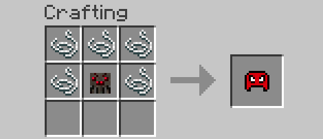
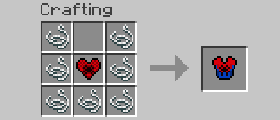
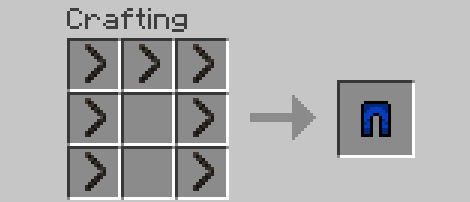
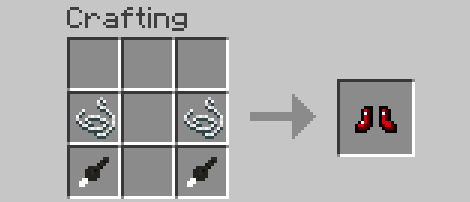
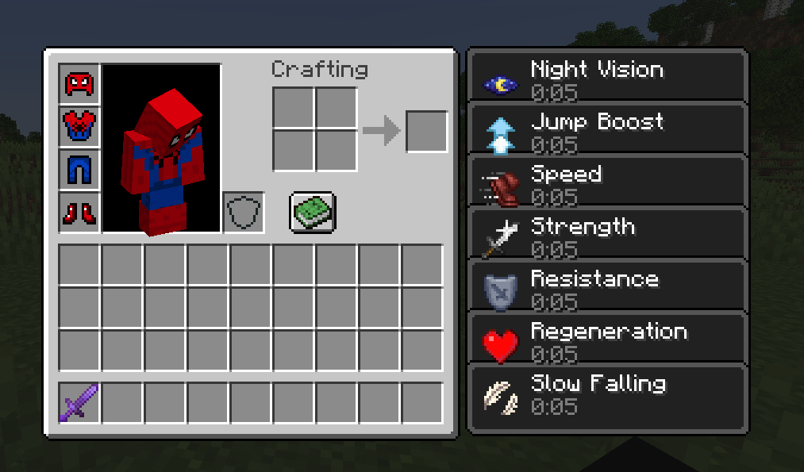
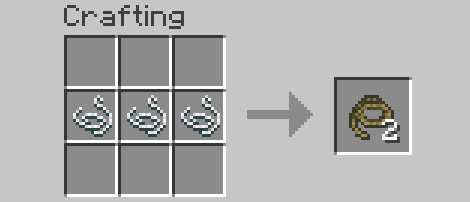
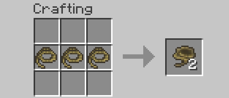
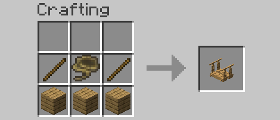
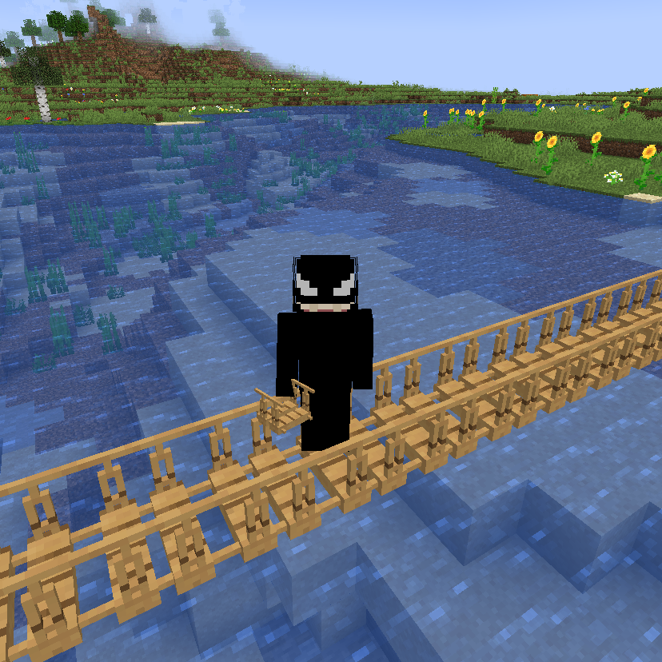

# Spiderman / Bridging / Spider Rework Mod
This mod reworks how spiders work in Minecraft by adding new recipes, blocks, and armor to the game!

## 🕸️ Spiderman Armour
The Spiderman Armour set, inspired from the 2021 film "No Way Home", allows players to craft the same suit Spiderman uses with lucky drops from spiders! Needing 4 new unique items including the Spider Head, Spider Heart, Spider Leg, and Spider Feet, this new armour allows for a massive upgrade to mid-game players with little to no grinding!

The item drop chances:
- Spider Head --> dropped from spiders (10%)
- Spider Heart --> dropped from cave spiders (10%)
- Spider Leg --> dropped from spiders (50%)
- Spider Feet --> dropped from spiders (30%)

## 🛠️ Here's how to craft them into our brand new Spidey Armour:

## 🛡️ And here's how the amazing armour looks!

## 💪 Stats of the armour
Did you really think there would be a lame new armour added with no cool effects? Here are some of the features!

- Same durability and protection as Netherite Armour
- No knockback resistance
- Potion effects when armour is equiped
- - Speed 1, Strength 1, Resistence 1, Jump Boost 1, Slow-Falling 1, Night Vision, and Regeneration 1

## 🌉 Bridging Block
The Oak Bridge is a new block added that allows players to traverse through big gaps much easier! Made with a custom texture, this block can be crafted by using a new item called the Rope Pile. 

## 🛠️ Here's how to ultimately craft the new Oak Bridge:

## 👀 Here's how it looks ingame!

